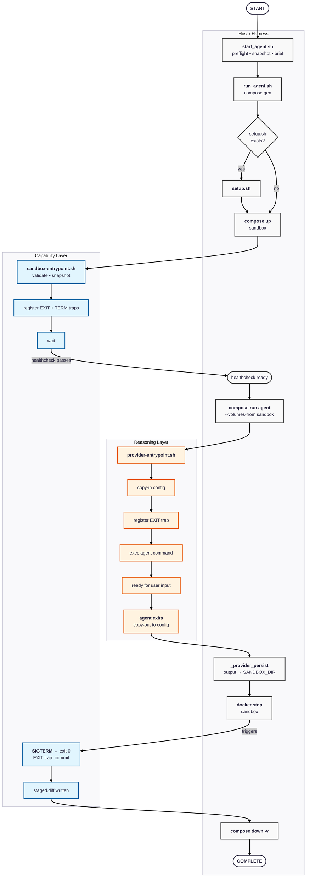

```mermaid
---
config:
      theme: redux
---
flowchart TD
    %% Global Styles
    classDef host fill:#f9f9f9,stroke:#333,stroke-width:2px;
    classDef cap fill:#e1f5fe,stroke:#01579b;
    classDef rsn fill:#fff3e0,stroke:#e65100;

    START([<b>START</b>]) --> SA

    subgraph HOST [Host / Harness]
        SA["<b>start_agent.sh</b><br/>preflight • snapshot • brief"]
        RA["<b>run_agent.sh</b><br/>compose gen"]
        DEC{setup.sh<br/>exists?}
        SH["<b>setup.sh</b>"]
        CUS["<b>compose up</b><br/>sandbox"]
        WAIT_HC([healthcheck ready])
        CRA["<b>compose run agent</b><br/>--volumes-from sandbox"]
        PP["<b>_provider_persist</b><br/>output → SANDBOX_DIR"]
        DSS["<b>docker stop</b><br/>sandbox"]
        CDV["<b>compose down -v</b>"]
        END([<b>COMPLETE</b>])
    end

    subgraph CAP [Capability Layer]
        SE["<b>sandbox-entrypoint.sh</b><br/>validate • snapshot"]
        TR["register EXIT + TERM traps"]
        WAIT["wait"]
        SIGTERM["<b>SIGTERM</b> → exit 0<br/>EXIT trap: commit"]
        DIFF["staged.diff written"]
    end

    subgraph RSN [Reasoning Layer]
        PE["<b>provider-entrypoint.sh</b>"]
        CI["copy-in config"]
        ET["register EXIT trap"]
        EX["exec agent command"]
        RDY["ready for user input"]
        AE["<b>agent exits</b><br/>copy-out to config"]
    end

    %% Logic Flow
    SA --> RA --> DEC
    DEC -- yes --> SH --> CUS
    DEC -- no --> CUS
    CUS --> SE
    SE --> TR --> WAIT
    WAIT -- healthcheck passes --> WAIT_HC
    WAIT_HC --> CRA
    CRA --> PE
    PE --> CI --> ET --> EX --> RDY --> AE
    AE --> PP --> DSS
    DSS -- triggers --> SIGTERM
    SIGTERM --> DIFF --> CDV --> END

    %% Apply Styles
    class SA,RA,DEC,SH,CUS,WAIT_HC,CRA,PP,DSS,CDV host;
    class SE,TR,WAIT,SIGTERM,DIFF cap;
    class PE,CI,ET,EX,RDY,AE rsn;
```