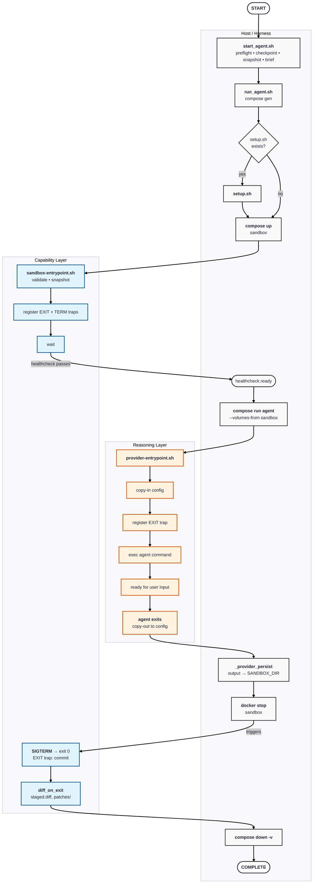

# Execution Model

This document describes the structure of a single agent run: the directory layout, how the harness is invoked, how compose configuration is generated, how the two containers are mounted and wired together, and their start and stop sequences.

Capability layer session arc (fork, work, join) is in [`sandbox_lifecycle.md`](sandbox_lifecycle.md). Reasoning layer session arc (copy-in, work, copy-out) is in [`provider_lifecycle.md`](provider_lifecycle.md). The external contract — image naming, mount shape guarantees, execution modes — is in [`tool_interface.md`](tool_interface.md).

---

## Directory Layout

The harness operates against two directories: `PROJECT_DIR` (the project git repository) and `SANDBOX_DIR` (the harness workspace). Both are absolute paths supplied via `.env`. Their location relative to each other on the host is not constrained.

```
SANDBOX_DIR/
├── Makefile
├── .env
├── .<provider>/               ← provider config (seeded at onboard; persists across sessions)
├── .snapshot/                 ← project snapshot (built at run time by harness)
└── .workspace/                ← harness I/O channels
    ├── input/                 ← operator-placed task briefs and addenda (RO to agent)
    ├── output/                ← agent progress and serialised data (RW, no binaries)
    └── session-diffs/         ← diff pipeline output
        └── <session-name>/    ← session-scoped directory
            ├── staged.diff
            └── patches/       ← per-commit .patch files

Capability layer container (CWD: /home/agentuser/)
├── .snapshot/                 ← RO bind mount: project snapshot from host
├── workspace/session-diffs/   ← RW bind mount: diff output
└── sandbox/                   ← RW Docker volume: working content (owned by this container)

Reasoning layer container (CWD: /home/agentuser/)
├── workspace/input/           ← RO bind mount: task briefs, operator addenda
├── workspace/output/          ← RW bind mount: agent progress (no binaries)
├── sandbox/                   ← RW Docker volume: shared from capability layer via --volumes-from
├── /opt/provider-config/      ← RW bind mount: provider config ($SANDBOX_DIR/.<provider>/)
└── .<provider>/               ← provider config dir (populated via copy-in from /opt/provider-config/)
```

Host path variables are defined in [`tool_interface.md` — `.env` Runtime Variables](tool_interface.md#env-runtime-variables).

---

## Invocation Model

`scripts/start_agent.sh` is invoked by the project-side Makefile via the `agent-sandbox` CLI. It handles host-side pre-flight only: path validation, `.env` loading, git validation, workspace directory setup, checkpoint tag creation, snapshot pipeline (rsync), and brief resolution. On completion it dispatches to `scripts/run_agent.sh` via `exec`.

`scripts/run_agent.sh` owns the provider lifecycle: sourcing the provider setup hook, assembling and generating the compose file, managing the container lifecycle (start, agent attach, teardown).

Container paths are fixed by the harness and not configurable via `.env`. The full mount shape is in [`tool_interface.md` — Mount Shape Guarantees](tool_interface.md#mount-shape-guarantees).

---

## Compose Generation

`scripts/run_agent.sh` generates the compose configuration on each run. Compose files are written to a tmpfile — never to `SANDBOX_DIR` — and are not operator-managed.

**Tmpfile generation:** `compose_generate` in `libs/compose.sh` merges the base template with any applicable overlays using `docker compose config --no-interpolate`, bakes image names and host paths into the result, and preserves operator secrets as `${VAR}` for runtime resolution. The merged tmpfile is owned and cleaned up by `scripts/run_agent.sh` on exit.

**Baked vs `${VAR}` split:** Image names, container names, service dependencies, volume definitions, and internal mount paths are baked at generation time — they are stable per project and do not vary between runs. Machine-specific values — host paths, ports, credentials — are preserved as `${VARIABLE}` and resolved from `.env` at runtime by Docker Compose.

**Why host paths are baked:** `docker compose config --no-interpolate` relativises unresolved path variables against the staging directory. Baking host paths at generation time — after reading `.env` — avoids this relativisation and produces correct absolute paths in the merged file.

**Why explicit `type: bind`:** Docker Compose misclassifies `${VAR}` sources as named volumes in short volume syntax. All volume mounts use explicit `type: bind` syntax to prevent this.

**Mode composition:**

| Mode | Compose files |
|---|---|
| `standard` | Base template only (+ provider overlay if present) |
| `serve` | Base template + provider overlay (if present) + `providers/<n>/docker-compose.serve.yml` |
| `dry-run` | Base template + provider overlay (if present) + `libs/docker-compose.dry-run.yml` |

The provider overlay (`providers/<n>/docker-compose.<n>.yml`) is optional — merged if the file exists. It covers mounts and environment variables that apply in all modes. The serve and dry-run overlays are static files in the repo, never written to `SANDBOX_DIR`.

---

## Mount Shape Rationale

The mount shape table is the contract defined in [`tool_interface.md` — Mount Shape Guarantees](tool_interface.md#mount-shape-guarantees). This section records why the shape is what it is.

### Why subdirectory mounts rather than the workspace parent

Each `.workspace/` subdirectory has a different trust level and a different container owner. Mounting them separately enforces ownership at the filesystem level: the capability layer cannot write to `workspace/input/` because it is not mounted; the reasoning layer cannot write to `workspace/session-diffs/` for the same reason.

- `input/` — operator-written, agent-read (reasoning layer, read-only)
- `output/` — agent-written (reasoning layer, read-write)
- `session-diffs/` — harness-written (capability layer, read-write — diff pipeline)

### Why `.snapshot/` is read-only and capability-layer-only

The snapshot is an input prepared before the run. Mounting it read-only prevents either container from modifying the baseline. Only the capability layer needs it — it copies the snapshot into `sandbox/` at startup and does not reference it again.

### Why `output/` prohibits binaries

`output/` is the reasoning layer's persistent output channel to the host. Restricting it to text and serialised data limits the attack surface — a compromised agent cannot write executable files that the operator might inadvertently run on the host.

### Why provider config uses a bind mount via `/opt/provider-config/`

Provider config cannot be bind-mounted directly as `AGENT_HOME` because agents may perform filesystem operations (cross-device moves from `/tmp`, binary writes) that fail on host-mounted paths, particularly on Windows. Mounting at `/opt/provider-config/` and having `provider-entrypoint.sh` copy into `AGENT_HOME` gives the agent full ownership of its working directory while keeping the host sync path clean.

### Why `--volumes-from` rather than a named volume for `sandbox/`

A named Docker volume is daemon-managed and persists independently of any container. This breaks capability layer ownership: a second session would find the previous session's sandbox content in the volume, and any container could mount it regardless of whether the capability layer is running.

`--volumes-from` ties the sandbox lifecycle to the capability layer container. The reasoning layer can only access `sandbox/` while the capability layer container exists.

**`VOLUME` declaration is required for `--volumes-from` to work.** Docker only exposes directories via `--volumes-from` if they are declared as volumes in the Dockerfile (`VOLUME /home/agentuser/sandbox`). The `VOLUME` instruction promotes `sandbox/` to an anonymous Docker volume at container creation time.

The anonymous volume is created fresh at each session start and destroyed on teardown (`docker compose down -v`).

---

## Session Lifecycle

The following diagram shows the full control flow for a standard session across all three execution contexts.



---

## Staleness Detection

Docker's layer cache is the primary staleness mechanism. `build_context_agent` and `build_context_sandbox` assemble deterministic build contexts from fixed sets of repo files. If any input file changes, Docker invalidates that layer and all downstream layers at the next build — no separate digest comparison is required.

A `agent-sandbox.digest` label is embedded in each image at build time for external tooling use.

---

## References

| Topic | Document |
|---|---|
| Two-layer conceptual model | [../concepts/two_layer_model.md](../concepts/two_layer_model.md) |
| Capability layer lifecycle | [sandbox_lifecycle.md](sandbox_lifecycle.md) |
| Reasoning layer lifecycle | [provider_lifecycle.md](provider_lifecycle.md) |
| External contract | [tool_interface.md](tool_interface.md) |
| System invariants and component overview | [system_overview.md](system_overview.md) |
| Operator-facing workflow | [../concepts/agent_workflow.md](../concepts/agent_workflow.md) |
| Security guarantees | [security.md](security.md) |
