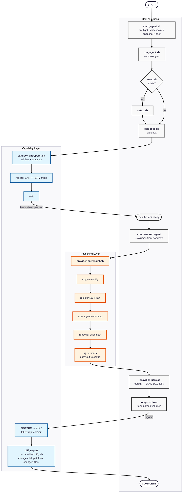

# Execution Model

This document describes the structure of a single agent run: the directory layout, how the harness is invoked, how compose configuration is generated, how the two containers are mounted and wired together, and their start and stop sequences.

Capability layer session arc (fork, work, join) is in [`sandbox_lifecycle.md`](sandbox_lifecycle.md). Reasoning layer session arc (copy-in, work, copy-out) is in [`provider_lifecycle.md`](provider_lifecycle.md). The external contract — image naming, mount shape guarantees, execution modes — is in [`tool_interface.md`](tool_interface.md).

---

## Directory Layout

The harness operates against two directories: `PROJECT_DIR` (the project git repository) and `SANDBOX_DIR` (the harness workspace). Both are absolute paths supplied via `.env`. Their location relative to each other on the host is not constrained.

```
SANDBOX_DIR/
├── Makefile
├── .env
├── .<provider>/               ← provider config (seeded at onboard; persists across sessions)
├── .snapshot/                 ← project snapshot (built at run time by harness)
└── .workspace/                ← harness I/O channels
    ├── input/                 ← operator-placed task briefs and addenda (RO to agent)
    ├── output/                ← agent progress and serialised data (RW, no binaries)
    └── session-diffs/         ← diff pipeline output
        ├── session/            ← exit artefacts
        │   └── <SESSION_TS>-<BRANCH>/  ← session-scoped directory
        │       ├── .export-status    ← STATUS, TIMESTAMP, INIT_SHA
        │       ├── uncommitted.diff
        │       ├── all-changes.diff
        │       ├── patches/         ← per-commit .diff files
        │       └── changed-files/   ← working tree copies
        └── autosave/           ← checkpoint artefacts
            └── <SESSION_TS>-<BRANCH>/  ← session-scoped directory
                ├── .export-status    ← STATUS, TIMESTAMP, INIT_SHA
                ├── uncommitted.diff
                ├── patches/
                └── changed-files/

Capability layer container (CWD: /home/agentuser/)
├── .snapshot/                 ← RO bind mount: project snapshot from host
├── workspace/session-diffs/   ← RW bind mount: diff output
└── sandbox/                   ← RW Docker volume: working content (owned by this container)

Reasoning layer container (CWD: /home/agentuser/)
├── workspace/input/           ← RO bind mount: task briefs, operator addenda
├── workspace/output/          ← RW bind mount: agent progress (no binaries)
├── sandbox/                   ← RW Docker volume: shared from capability layer via --volumes-from
└── .<provider>/               ← provider config dir, layout defined by provider
    ├── agent/                 ← Pi convention: nested config directory
    │   ├── prompts/           ← RW bind mount: provider-layer prompts (persists)
    │   ├── sessions/          ← RW bind mount: session history (persists)
    │   ├── skills/            ← RW bind mount: provider-layer skills (persists)
    │   ├── bin/               ← overlayfs: container-local, same fs as /tmp/ (mv safe)
    │   ├── settings.json     ← ephemeral: copy-in from image template at startup
    │   ├── auth.json          ← ephemeral: copy-in from image template at startup
    │   ├── models.json        ← ephemeral: copy-in from image template at startup
    │   └── AGENTS.md          ← ephemeral: copy-in from image template at startup
    └── .env                   ← host-provided: API keys (never committed)
```

Host path variables are defined in [`tool_interface.md` — `.env` Runtime Variables](tool_interface.md#env-runtime-variables).

---

## Invocation Model

`scripts/start_agent.sh` is invoked by the project-side Makefile via the `agent-sandbox` CLI. It handles host-side pre-flight only: path validation, `.env` loading, git validation, workspace directory setup, checkpoint tag creation, snapshot pipeline (rsync), and brief resolution. On completion it dispatches to `scripts/run_agent.sh` via `exec`.

`scripts/run_agent.sh` owns the provider lifecycle: sourcing the provider setup hook, assembling and generating the compose file, managing the container lifecycle (start, agent attach, teardown).

Container paths are fixed by the harness and not configurable via `.env`. The full mount shape is in [`tool_interface.md` — Mount Shape Guarantees](tool_interface.md#mount-shape-guarantees).

---

## Compose Generation

`scripts/run_agent.sh` generates the compose configuration on each run and
writes it to a stable on-disk path: `$SANDBOX_DIR/.compose/<run-id>.yml`. The
file persists after the session ends — it is the session's compose record and
an inspection handle (e.g. `docker compose -f .compose/<run-id>.yml config`).
Resume reuses the same RUN_ID and overwrites its own file; each unique session
leaves one record. Containers mount only SANDBOX_DIR subdirectories, so the
file is never visible in the agent workspace. `.compose/` is gitignored.

**Merged generation:** `compose_generate` in `libs/compose.sh` merges the base
template with any applicable overlays using `docker compose config
--no-interpolate`, bakes image names and host paths into the result, and
preserves operator secrets as `${VAR}` for runtime resolution.

**Baked vs `${VAR}` split:** Image names, container names, service dependencies, volume definitions, and internal mount paths are baked at generation time — they are stable per project and do not vary between runs. Machine-specific values — host paths, ports, credentials — are preserved as `${VARIABLE}` and resolved from `.env` at runtime by Docker Compose.

**Why host paths are baked:** `docker compose config --no-interpolate` relativises unresolved path variables against the staging directory. Baking host paths at generation time — after reading `.env` — avoids this relativisation and produces correct absolute paths in the merged file.

**Why explicit `type: bind`:** Docker Compose misclassifies `${VAR}` sources as named volumes in short volume syntax. All volume mounts use explicit `type: bind` syntax to prevent this.

**Mode composition:**

| Mode | Compose files |
|---|---|
| `standard` | Base template only (+ provider overlay if present) |
| `serve` | Base template + provider overlay (if present) + `providers/<n>/docker-compose.serve.yml` |
| `dry-run` | Base template + provider overlay (if present) + `libs/docker-compose.dry-run.yml` |

The provider overlay (`providers/<n>/docker-compose.<n>.yml`) is optional — merged if the file exists. It covers mounts and environment variables that apply in all modes. The serve and dry-run overlays are static files in the repo; only the merged result is written to `SANDBOX_DIR` (at `.compose/<run-id>.yml`).

**File accumulation:** compose files accumulate one per unique RUN_ID (KB-scale
per session). Pruning of stale `.compose/*.yml` is deferred and tracked in the
roadmap — see the M2.6 deferred-items list.

---

## Mount Shape Rationale

The mount shape table is the contract defined in [`tool_interface.md` — Mount Shape Guarantees](tool_interface.md#mount-shape-guarantees). This section records why the shape is what it is.

### Why subdirectory mounts rather than the workspace parent

Each `.workspace/` subdirectory has a different trust level and a different container owner. Mounting them separately enforces ownership at the filesystem level: the capability layer cannot write to `workspace/input/` because it is not mounted; the reasoning layer cannot write to `workspace/session-diffs/` for the same reason.

- `input/` — operator-written, agent-read (reasoning layer, read-only)
- `output/` — agent-written (reasoning layer, read-write)
- `session-diffs/` — harness-written (capability layer, read-write — diff pipeline)

### Why `.snapshot/` is read-only and capability-layer-only

The snapshot is an input prepared before the run. Mounting it read-only prevents either container from modifying the baseline. Only the capability layer needs it — it copies the snapshot into `sandbox/` at startup and does not reference it again.

### Why `output/` prohibits binaries

`output/` is the reasoning layer's persistent output channel to the host. Restricting it to text and serialised data limits the attack surface — a compromised agent cannot write executable files that the operator might inadvertently run on the host.

### Why provider config uses a bind mount via `/opt/provider-config/`

Provider config cannot be bind-mounted directly as `AGENT_HOME` because agents may perform filesystem operations (cross-device moves from `/tmp`, binary writes) that fail on host-mounted paths, particularly on Windows. Mounting at `/opt/provider-config/` and having `provider-entrypoint.sh` copy into `AGENT_HOME` gives the agent full ownership of its working directory while keeping the host sync path clean.

### Why `--volumes-from` rather than a named volume for the agent's `sandbox/` view

The reasoning layer (agent) shares the capability layer's `sandbox/` mount via
`--volumes-from` (see the compose `agent` service). This ties the agent's view
of `sandbox/` to the capability layer container's lifecycle, so the agent can
only access it while the capability container exists.

**`VOLUME` declaration is required for `--volumes-from` to work.** Docker only
exposes directories via `--volumes-from` if they are declared as volumes in the
Dockerfile (`VOLUME /home/agentuser/sandbox`).

**The sandbox workdir itself is a named volume.** The compose file mounts a
RUN_ID-scoped named volume (`{{RUN_ID}}-sandbox-data`) at `/home/agentuser/sandbox`
on the sandbox service. This named volume persists across `docker compose down`
(which keeps named volumes) so the session state survives stop/start — see
[Container State Contract](#container-state-contract) and Session Lifecycle.

---

## Container State Contract

This is the as-expected record of what lives where across a session, so future
changes (for example allowing the agent to do environment setup) preserve the
contract knowingly.

**The container is disposable.** Removing or rebuilding a session's containers
loses nothing user-authored. Durable state lives in the named volume and bind
mounts; the container writable layer holds only regenerable content.

| What | Where it lives | Survives `docker compose down`? |
|---|---|---|
| Agent WORKDIR `/home/agentuser/sandbox` (project worktree, `node_modules` from `npm install`, session work) | named volume `{{RUN_ID}}-sandbox-data` | ✅ yes (named volume persists) |
| Agent state `.pi/{prompts,sessions,skills}` | bind-mounted to `$SANDBOX_DIR/.pi/...` | ✅ yes (host) |
| Harness workspace `.workspace/{session-diffs,input,output}` | bind-mounted to `$SANDBOX_DIR/.workspace/...` | ✅ yes (host) |
| Snapshot baseline `.snapshot/` | bind-mounted read-only | ✅ yes (host, read-only) |
| Config files `.pi/settings.json`, `auth.json`, `models.json`, `AGENTS.md`, `bin/` | container writable layer, copy-in from baked image at startup | ❌ regenerated on start |
| Caches `~/.npm`, `~/.cache` | container writable layer | ❌ disposable |

Consequence: `make stop` and session teardown remove the containers (and the
per-session network) and keep the named volume. Resume comes from the volume,
not from stopped containers. If a future feature lets the agent do persistent
environment setup, that state must be persisted to the named volume (or a bind
mount), not left in the container writable layer, to keep the contract intact.

---

## Docker verb semantics note

Docker's lifecycle verbs have specific meanings that our command shape only
partially matches:

| Docker verb | Docker meaning | Our use |
|---|---|---|
| `docker start` | start an existing stopped container | (unused) — our `start` is full setup: `compose up` + `compose run agent` |
| `docker stop` | pause a container for later same-container restart | `scripts/stop.sh` previously used this; now teardown is `compose down` |
| `docker compose down` | end the session; remove containers + network; keep named volumes | our teardown (`session_teardown` → `down`) |
| `docker compose down -v` | also remove named volumes | our full reset (`session_destroy`) |

Our `start` = full setup and `stop` = session teardown do not match docker's
`start`/`stop` pause-resume semantics. This is a known divergence; a future
decision should choose whether to inherit docker's language (and therefore
semantics) or rename to avoid ambiguity. The harness functions are named
`session_teardown`/`session_destroy` (intent-based) to avoid implying the
docker `stop` verb.

---

## Session exit semantics

`scripts/run_agent.sh` exits 0 on a clean session end in both modes:
standard (agent completes) and serve (operator runs `make stop`). Standard
mode propagates a non-zero agent exit code to the caller. Teardown is
guaranteed on every exit path after the session starts — agent completion,
agent failure, `compose up` failure, or sandbox health-wait failure — via
run_agent.sh's EXIT trap (`_session_cleanup`), so containers and the session
network never leak. Serve mode always exits 0 — its session ends via
`make stop` → `docker stop`, and the container's exit code on that path
(SIGTERM/SIGKILL, 137/143) is an artifact of the stop mechanism, not a
session result.

---

## Session Lifecycle

The following diagram shows the full control flow for a standard session across all three execution contexts.


```mermaid
---
config:
      theme: redux
---
flowchart TD
    %% Global Styles
    classDef host fill:#f9f9f9,stroke:#333,stroke-width:2px;
    classDef cap fill:#e1f5fe,stroke:#01579b;
    classDef rsn fill:#fff3e0,stroke:#e65100;

    START([<b>START</b>]) --> SA

    subgraph HOST [Host / Harness]
        SA["<b>start_agent.sh</b><br/>preflight • checkpoint • snapshot • brief"]
        RA["<b>run_agent.sh</b><br/>compose gen"]
        DEC{setup.sh<br/>exists?}
        SH["<b>setup.sh</b>"]
        CUS["<b>compose up</b><br/>sandbox"]
        WAIT_HC([healthcheck ready])
        CRA["<b>compose run agent</b><br/>--volumes-from sandbox"]
        PP["<b>_provider_persist</b><br/>output → SANDBOX_DIR"]
        CD["<b>compose down</b><br/>keep named volumes"]
        END([<b>COMPLETE</b>])
    end

    subgraph CAP [Capability Layer]
        SE["<b>sandbox-entrypoint.sh</b><br/>validate • snapshot"]
        TR["register EXIT + TERM traps"]
        WAIT["wait"]
        SIGTERM["<b>SIGTERM</b> → exit 0<br/>EXIT trap: commit"]
        DIFF["<b>diff_export</b><br/>uncommitted.diff, all-changes.diff, patches/, changed-files/"]
    end

    subgraph RSN [Reasoning Layer]
        PE["<b>provider-entrypoint.sh</b>"]
        CI["copy-in config"]
        ET["register EXIT trap"]
        EX["exec agent command"]
        RDY["ready for user input"]
        AE["<b>agent exits</b><br/>copy-out to config"]
    end

    %% Logic Flow
    SA --> RA --> DEC
    DEC -- yes --> SH --> CUS
    DEC -- no --> CUS
    CUS --> SE
    SE --> TR --> WAIT
    WAIT -- healthcheck passes --> WAIT_HC
    WAIT_HC --> CRA
    CRA --> PE
    PE --> CI --> ET --> EX --> RDY --> AE
    AE --> PP --> CD
    CD -- triggers --> SIGTERM
    SIGTERM --> DIFF --> END

    %% Apply Styles
    class SA,RA,DEC,SH,CUS,WAIT_HC,CRA,PP,CD host;
    class SE,TR,WAIT,SIGTERM,DIFF cap;
    class PE,CI,ET,EX,RDY,AE rsn;
```

---

## Staleness Detection

Docker's layer cache is the primary staleness mechanism. The repo root is used as the Docker build context with repo-relative COPY instructions in each Dockerfile. If any input file changes, Docker invalidates that layer and all downstream layers at the next build — no separate digest comparison or temp-dir assembly is required.

---

## References

| Topic | Document |
|---|---|
| Two-layer conceptual model | [../concepts/two_layer_model.md](../concepts/two_layer_model.md) |
| Capability layer lifecycle | [sandbox_lifecycle.md](sandbox_lifecycle.md) |
| Reasoning layer lifecycle | [provider_lifecycle.md](provider_lifecycle.md) |
| External contract | [tool_interface.md](tool_interface.md) |
| System invariants and component overview | [system_overview.md](system_overview.md) |
| Security guarantees | [security.md](security.md) |
