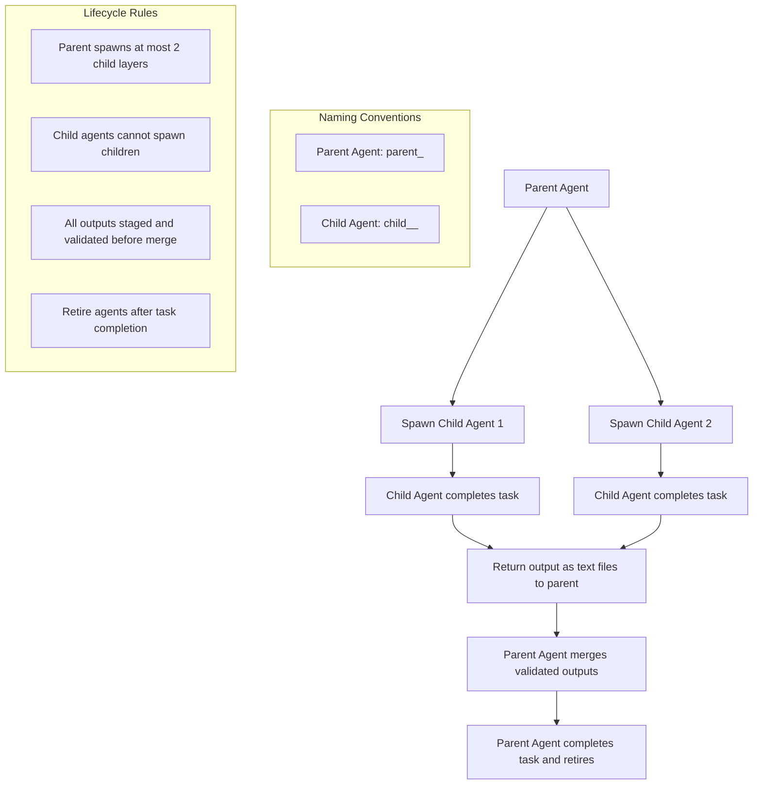

# OpenCode Agent Workflow

This document defines the authoritative workflow for OpenCode agents.  
It describes how isolation, staging, and reproducibility are enforced, how host and container folders interact, and how changes move from agent execution back into the repository.

This is a source document describing the intended workflow.  
Implementation details (Dockerfiles, scripts) are intentionally excluded.

---

# 1. High-Level Workflow Summary



OpenCode is designed around three core principles:

## 1. Isolation

- Agents run inside containers.
- Host source code (`src/`) is mounted read-only.
- Agents cannot modify host files directly.
- Only `.workspace/` is writable inside the container.

This prevents uncontrolled mutation of the repository.

(Note: Detailed security guarantees and network policy are defined in `SECURITY.md`.)

---

## 2. Staging

- Agents perform modifications inside an internal sandbox copy of the project.
- The sandbox is initialized from read-only `src/` and `tests/` mounts.
- A git repository is initialized inside the sandbox.
- On container exit, a staged diff is generated:
  - `git add -A`
  - `git diff --cached > /project/.workspace/patch.diff`

Textual outputs (analysis, logs, reports) go under:
- `.workspace/changes/reports/`

No changes are applied directly to the working tree.

All modifications must pass through a review and staging step.

`patch.diff` is the primary artifact for proposed source changes.

---

## 3. Reproducibility

Each agent run must be reproducible via:

- A container image version
- A specific commit or branch
- A `metadata.json` file capturing:
  - agent_id
  - task_id
  - timestamps
  - configuration mode
  - allowed paths

This ensures that:

- Every change can be traced
- Every run can be replayed
- Every decision can be audited

---

# 2. Project Folder Workflow

## 2.1 Host Project Structure

Confirmed host structure:
```
~/opencode-projects/project-alpha/
├── src/ <-- host code, read-only for agent
├── tests/ <-- host tests
├── .workspace/ <-- agent writes all outputs here
│ └── changes/
└── logs/ <-- optional, ignored for now
```


### Host Responsibilities

- `src/` and `tests/` are the authoritative repository contents.
- `.workspace/` is the staging buffer.
- `logs/` may contain execution logs (optional at this stage).

The host is the source of truth.  
The agent never mutates it directly.

---

## 2.2 Container Mount Mapping

Inside the container, the project is mounted at:
```
/home/agentuser/project/
```
Mount rules:

| Host Path | Container Path | Mode | Purpose |
|------------|----------------|------|----------|
| `src/` | `/project/src/` | read-only | Source code reference |
| `tests/` | `/project/tests/` | read-only | Test reference |
| `.workspace/` | `/project/.workspace/` | read-write | Agent output channel |

All write operations must occur under `/project/.workspace/`.

(Read-only enforcement and isolation guarantees are defined in `SECURITY.md`.)

---

## 2.3 Container Workspace Behavior

Inside the container:

1. Read-only mounts:
   - `/project/src`
   - `/project/tests`
2. A writable internal sandbox is created.
3. `src/` and `tests/` are copied into the sandbox.
4. A git repository is initialized inside the sandbox.
5. Agent modifies files inside the sandbox.
6. On exit:
   - A staged diff is generated.
   - `patch.diff` is written to `/project/.workspace/`.

`.workspace/` is the only persistent output channel from the agent.

Reports and structured outputs must be written under:
```
.project/.workspace/changes/reports/
```

---

# 3. Container Lifecycle

## 3.1 Pre-Execution

1. Host repository is checked out.
2. A feature branch is created:`feature/agent-<agent_id>-<task_id>`
3. The working tree is clean.
4. `.workspace/` is empty or archived.
5. Container is started with defined mounts and limits.

At this point, the container sees:

- Read-only source code
- Writable `.workspace/`

---

## 3.2 Execution Phase

Inside the container:

1. Agent reads:
- `/project/src`
- `/project/tests`
- `/project/.workspace/metadata.json` (if pre-seeded)
2. Agent performs task inside the sandbox copy.
3. Agent writes:
- `/project/.workspace/changes/reports/` (analysis, logs)
4. On exit:
- `patch.diff` is generated and written to `/project/.workspace/patch.diff`
- `/project/.workspace/metadata.json` is finalized

Container is then stopped.

No repository files have been modified.

---

## 3.3 Return Staging (Host Side)

After container termination:

1. Host inspects:
```
.workspace/patch.diff
.workspace/changes/
.workspace/metadata.json
```
2. Human or parent agent reviews staged outputs.
3. Validation steps may include:
- Linting
- Running tests
- Manual inspection
- Policy checks

If rejected:
- `.workspace/` may be archived.
- Feature branch may be deleted.

If approved:
- `patch.diff` is applied to the working tree.
- Changes are committed to the feature branch.

---

## 3.4 Feature Branch Lifecycle

1. Branch created before container execution.
2. Agent produces staged changes.
3. Host applies approved patch to the branch.
4. Tests are run.
5. Commit is created:
- Includes metadata reference.
6. Pull request or merge to `main`.

After merge:

- `.workspace/` is cleared or archived.
- Branch may be deleted.
- Logs retained.

---

# 4. Return Write-Back Rules

Changes are written back only when:

- The container has exited.
- Outputs are fully staged.
- Validation has completed.
- Approval is granted.

The agent itself never:

- Executes `git commit`
- Executes `git push`
- Writes to `src/` directly

All repository mutation occurs outside the container.

This separation enforces:

- Deterministic review
- Auditability
- Clear responsibility boundaries

---

# 5. Summary of Responsibilities

## Agent (Inside Container)

- Read-only access to code
- Writes only to `.workspace/`
- Produces deterministic staged outputs
- Provides metadata for reproducibility

## Host

- Manages branches
- Validates changes
- Applies staged modifications
- Commits and merges
- Maintains audit trail

---

# 6. Core Invariants

If the workflow is followed:

- No unreviewed code reaches `main`
- No direct mutation occurs from inside the container
- Every change is traceable to an agent and task
- Runs are reproducible and auditable
- Staging is enforced structurally via `.workspace/`

---

This document defines the OpenCode Agent Workflow.  
Security guarantees, threat boundaries, and network policies are defined separately in `SECURITY.md`.